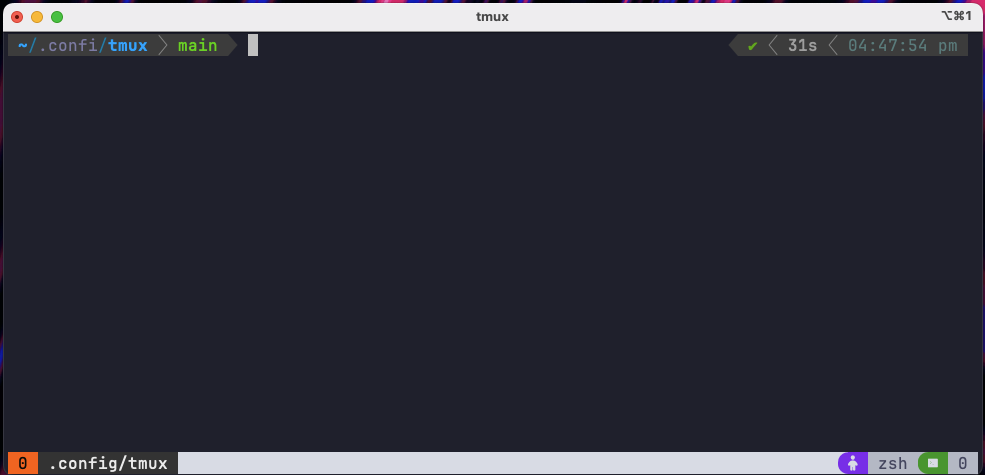

# tmux-config
My [tmux](https://github.com/tmux/tmux) config file for modern color theme and vim like pane navigator that works seamlessly with my [Neovim](https://github.com/faizan2786/NVChad) config.

## Showcase


## How to use
- Install `tmux` using your favourite package manager i.e. for MacOS use below command:
  ```zsh
  brew install tmux
  ```
- Install tmux package manager [TPM](https://github.com/tmux-plugins/tpm) in your home's config directory using following command:
  ```zsh
  git clone https://github.com/tmux-plugins/tpm ~/.tmux/plugins/tpm
  ```
- Download `tmux.config` file from this repo and move it to your `<config_dir>/tmux/` location. i.e. in `~/.config/tmux/` dir.

- Start a new tmux session i.e. by running `tmux` command in your terminal
- Run below command
  ```zsh
  tmux source ~/.config/tmux/tmux.conf
  ```
    - This will apply the downloaded config to tmux.
- Now, type `<Ctrl+b>` followed by `<Shift+I>`
  - This will trigger TPM to install all the plugins in the config file.
- And... **that's it** - enjoy your new tmux setup!
